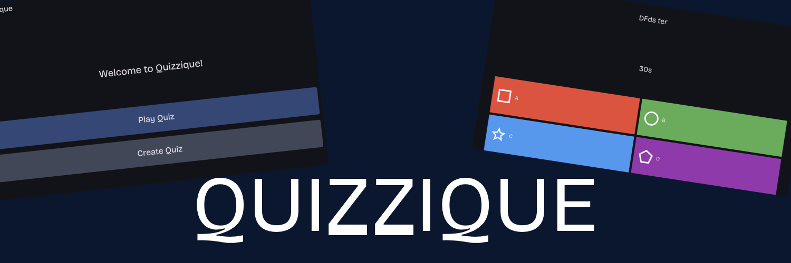

# Quizzique
## An open-source alternative to Kahoot! built with Flutter and Appwrite.

## How to play
1. **Create a Quiz:** Start by making your own quiz with custom questions.
2. **Start a Game:** Launch your quiz to begin a new game session.
3. **Join a Game:** Enter a game code or scan the QR Code in order to join a session.
4. **Answer Questions:** Play along by answering each question as it appears.
5. **View Results:** When the game ends, check out your results and see how you did.

## Features
- **Create and Join Games:** Set up new games or join others easily with a game code.
- **Real-time Updates:** Get instant updates during the game, including new questions and live scores.
- **Responsive Design:** Works smoothly on both mobile devices and the web.

## How to self-host
1. **Set Up Appwrite:** Follow the [Appwrite installation guide](https://appwrite.io/docs/installation) to get your server running, or use Appwrite Cloud.
2. **Create a Project:** Make a new project in Appwrite.
3. **Configure Database:** Set up the collections your app needs in Appwrite's database according to the [database scheme](DATABASE.md).
4. **Update environment variables:** Add your Appwrite details to the `dotenv` file (using the dotenv.example template).
5. **Prepare to build:** Install [Flutter](https://flutter.dev/) if you haven't already, then run `flutter pub get` to install dependencies.
6. **Build the app:** Run `flutter build web --release` to compile the app for the web. The output will be in the `build/web` directory and can be served using any static file server. Note that if you're using a subdirectory in your web server, you may need to adjust the base href in the `index.html` file by providing the `--base-href` option. To be able to use URLs correctly, make sure to set the index.html also as the 404 page.

## Why Quizzique?
Alternatives like Kahoot! or Blooket all suffer from the same limitation that made me create Quizzique: a limit of a certain number of players per game unless you pay some expensive subscription that you're only gonna use once or twice. Quizzique aims to provide a completely free and open-source alternative that allows unlimited players, making it accessible for everyone. You can either use the "hosted" version, or self-host it yourself using the provided guide.

#### AI was solely used for code completion.
#### This project was created during the Summer of Code 2025 by HackClub.